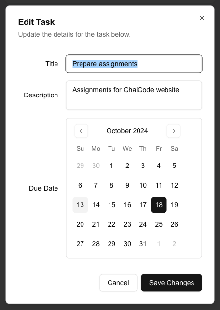
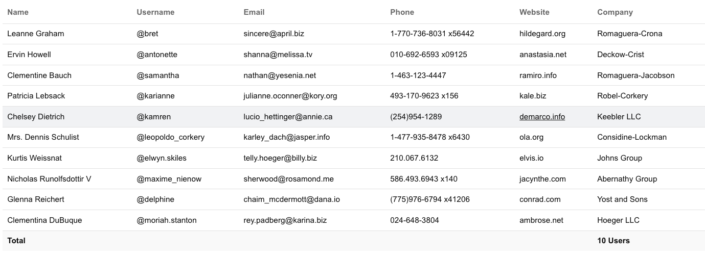

# MasterJi Assignment

## Modern Dashboard Application

### Project Overview

You are expected to build a **dashboard web application** using technology stack of **Next.js**, **React**, **Tailwind CSS**, and **TypeScript**. It must demonstrate the following expertise in component composition, API integration, responsive design, and modern state management. The application must include the following three core functionalities spread across multiple routes:

1. **Weather and News Dashboard**
2. **Interactive Kanban Board**
3. **Analytics Dashboard with Charts and Tables**

### Technology Stack

- **Frontend Framework:** Next.js v15
- **Styling:** Tailwind CSS
- **UI Components:** Shadcn UI
- **API Handling:** Axios
- **Drag-and-Drop:** `@hello-pangea/dnd`
- **Charts:** `chart.js` + `react-chartjs-2`
- **Persistence:** LocalStorage for Kanban state

## **Features by Page**

### 1. **Weather and News Dashboard (Route: `/dashboard/weather-news`)**

This page integrates two public APIs to display **weather updates** and **news articles**.

#### **Weather Section:**

- **API Integration:** Uses OpenWeather API to display location, temperature, and conditions.
- **City Search:** Users can search for weather by city name.
- **Dynamic Data:** Weather details such as sunrise/sunset times are fetched from the API.
- **Loading State:** A loading spinner (using `Loader2` from Lucide React) is shown while fetching data.

#### **News Section:**

- **API Integration:** News articles are fetched from the News API.
- **Pagination:** The list of articles supports pagination for loading more news.
- **Error Handling:** Displays an appropriate message if the API call fails.

#### Screenshots

---

### 2. **Interactive Kanban Board (Route: `/dashboard/kanban`)**

The **Kanban board** demonstrates drag-and-drop functionality for task management.

#### **Features:**

- **Drag-and-Drop:** Implemented using Hello Pangea’s DnD library.
- **Columns:** Default columns include “To Do,” “In Progress,” and “Completed.”
- **Task Management:** Users can **create, edit, drag, and move tasks** between columns.
- **Modal Dialogs:** Radix UI Dialogs are used for adding tasks with title, description, and due date.
- **LocalStorage Persistence:** The board's state is saved in **localStorage** to persist data across page reloads.
- **Responsive Design:** The board adapts well to different screen sizes, including mobile views.

#### Screenshots

---

### 3. **Analytics Dashboard (Route: `/dashboard/analytics`)**

This page displays visual data using **charts** and a **dynamic table**.

#### **Charts Section:**

- **Library Used:** Chart.js with React integration.
- **Line Chart:** Displays user activity trends over the last 7 days.
- **Bar Chart:** Shows monthly sales performance.

#### **Dynamic Table:**

- **Data Population:** Uses a mock API to populate user data.
- **Features:** Includes pagination, search, and filtering capabilities.
- **Table Structure:** Built using a custom `Table` component with proper separation of header, body, and footer elements.
- **Loading State:** Displays a loading indicator while fetching data.

#### Screenshots

---

### Additional Requirements

1. **Common Navbar and Footer**: Implement a common `Navbar` with links to all pages and a `Footer` with branding information.
2. **Routing**: Ensure that each task is implemented on a different route:
   - `/dashboard/weather-news`
   - `/dashboard/kanban`
   - `/dashboard/analytics`
   - Base URL: `/` should redirect to `/dashboard/weather-news`.
3. **Dark Mode**: Implement a light/dark mode toggle throughout the application.
4. **Form Validation**: Use React Hook Form or similar libraries to handle form validations (e.g., when adding new tasks in the Kanban board).

## **Evaluation Parameters**

1. **Design Accuracy:** Ensure the implementation aligns with the provided screenshot designs.
2. **API Integration:** Proper handling of API responses and error states.
3. **State Management:** Effective use of React hooks and localStorage.
4. **Code Quality:** Clean, readable code with modular components.
5. **Performance Optimization:** Use lazy loading where necessary.
6. **Responsiveness:** Ensure the app works on both mobile and desktop screens.

## **Submission Instructions**

1. **GitHub Repository:** Push your code to a public GitHub repository.
2. **Deployment:** Host the application on **Vercel**, **Netlify**, or any other service.
3. **Documentation:** Include a `README.md` with setup instructions, screenshots, and the deployed link.
4. **Submit:** Share the repository link and the hosted application link.
